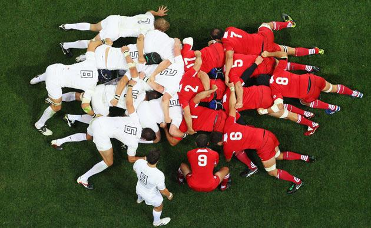

# The Agile Cheat sheet
> One minute to learn. The whole life to cultivate yourself

Hi! This cheat sheet about the Agile was created in order to revise the variety of principles and practices that 
live in the Agile\`s world, including the Agile itself, Scrum, Extrem Programming, and Kanban. I tried to
make the document succinct keeping its avail. Don\`t consider this text as a textbook. Use it just for revisions.
It\`s just a cheat sheet :)

## Feedback. Happy to read.
~~~
Email: aolenev@pm.com
Telegram: https://t.me/aolenev
~~~

## Foreword

The word “Scrum” is taken from rugby and denotes a team game method that allows you to take possession of the ball and lead it further across the field, and this requires coherence, unity of intent and a clear understanding of the goal.

